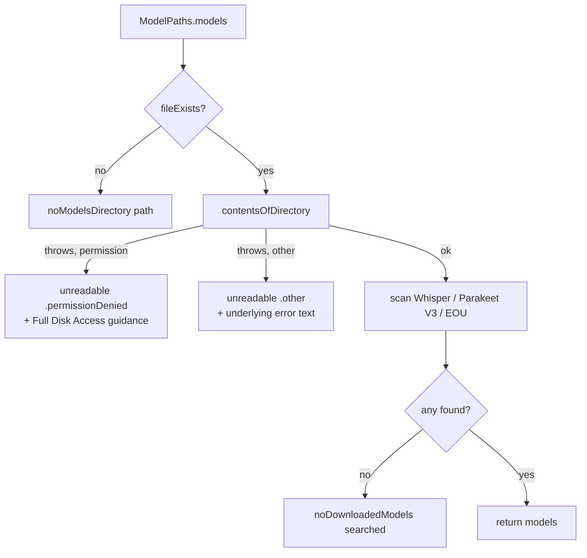

# Design Document: CLI Model Access Errors

## Overview

`wispr-cli` currently collapses three distinct situations into one message. This design separates
them and attaches actionable guidance to the one that users actually hit.

| Situation | Today | After |
|---|---|---|
| Models directory absent | "Wispr.app has not been set up yet" | Same, plus the resolved path |
| Models directory present but unreadable | "No models downloaded" *(wrong)* | Read failure naming the path and the Full Disk Access remedy |
| Models directory readable but empty | "No models downloaded" | Same, plus the resolved path |

`ModelPaths` is deliberately untouched: its container probe uses `fileExists`, which is permitted
under a TCC denial, so it already resolves the correct models root without Full Disk Access. The
bug is entirely in how the CLI handles the enumeration failure that follows.

| File | Change |
|---|---|
| `Sources/WisprCore/Utilities/FileAccess.swift` | **New** — permission classifier, strict directory read, and the Full Disk Access guidance text |
| `Sources/WisprCLI/WisprCLI.swift` | Restructure `CLIError`, route reads through `FileAccess`, make the preferences read throwing, print the resolved root under `--verbose` |
| `wisprTests/FileAccessTests.swift` | **New** — 25 tests across classification, strict reads, and message content |
| `CLAUDE.md` | Correct the documented shared model path |
| `README.md` | Add a CLI section documenting the Full Disk Access prerequisite |

### Placement: why the logic lives in WisprCore

The classifier, the strict read, and the guidance text sit in `WisprCore` rather than in the CLI,
next to `ModelPaths` whose path decisions create this failure mode in the first place.

The deciding factor is testability. The `WisprTests` target depends on `WisprApp` and `WisprCore`,
not on `WisprCLI`, and adding a dependency on an `@main` executable target would need changes to both
`Package.swift` and the Xcode test target for no design benefit. With the logic in `WisprCore` it is
covered by ordinary unit tests, and `CLIError` stays a thin presentation layer that formats what
`FileAccess` reports. The types are declared `nonisolated` to match `ModelPaths`, since the package
builds with `defaultIsolation(MainActor.self)` and `CLIError.description` is `nonisolated`.

## Architecture

Discovery becomes a linear sequence of decisions, each with exactly one outcome:



The critical property is that the `contentsOfDirectory` failure edge can no longer reach
`noDownloadedModels`. Today both edges converge there because the call is wrapped in `try?`.

### Design Rationale

**One probe, not three checks.** `discoverDownloadedModels()` currently reads the models directory
twice and the Whisper subdirectory once, each with `try?`. Reading the models directory once up
front and reusing the result means the permission failure is detected in exactly one place, and the
Parakeet scan no longer needs its own read. Fewer failure sites, one error path.

**`fileExists` is kept as a precondition, not as a permission check.** Under a TCC denial
`fileExists` returns `true`, which is precisely why it must not be treated as evidence that the
directory is usable. It stays only to distinguish "never set up" from "set up but unreadable".

**Classification degrades safely.** If the permission classifier fails to recognise an error shape,
the error still surfaces via the `.other` case with the underlying description attached. A
misclassification produces a verbose but truthful message, never a wrong one. This is what
Requirement 5.4 asks for, and it is the reason the design does not depend on getting the error codes
exactly right.

**Guidance lives in the error description.** ArgumentParser renders a thrown error by way of
`Error.describe()`, which for a `CustomStringConvertible` enum returns `String(describing:)`, i.e.
the `description` property. `MessageInfo.fullText` then prints `_errorPrefix + message` with no usage
block appended for the `.other` case. Verified in
`.build/checkouts/swift-argument-parser/Sources/ArgumentParser/Utilities/Foundation.swift:27` and
`Usage/MessageInfo.swift:126,168`. A multi-line `description` therefore prints verbatim after
`Error: `, and no changes to `run()` or custom output plumbing are needed.

## Components and Interfaces

### WisprCore: FileReadFailure, FileReadError, FileAccess

```swift
public nonisolated enum FileReadFailure: Sendable, Equatable {
    case permissionDenied
    /// Pre-rendered description of the underlying error.
    case other(String)
}

public nonisolated struct FileReadError: Error, Sendable, Equatable {
    public let path: String
    public let failure: FileReadFailure
}
```

`FileReadFailure.other` carries a `String` rather than the `Error` itself, because `any Error` is not
`Sendable` and storing it would either break the conformance or require an unchecked escape hatch.
The description is rendered at the throw site, where the error is still in hand. `Equatable`
conformance exists so tests can assert on the failure kind directly.

### CLIError restructuring

Cases gain the resolved path, and a single new case covers every unreadable read:

```swift
enum CLIError: Error, CustomStringConvertible, Sendable {
    /// A path that exists but cannot be read.
    /// `what` is a human-readable subject, e.g. "Wispr's model directory".
    case unreadable(what: String, error: FileReadError)

    case noModelsDirectory(path: String)
    case noDownloadedModels(searched: String)
    case noActiveModel
    case modelNotFound(String, available: [String])
    case fileNotFound(String)
}
```

`description` for `.unreadable` delegates to `FileAccess.explain(_:what:)`, so the guidance text has
exactly one definition and is unit-testable. One case rather than one per call site keeps it that
way; `what` and the error's `path` are enough for the user to tell which read failed.

### Permission classification

```swift
public nonisolated enum FileAccess {
    public static func isPermissionDenied(_ error: Error) -> Bool {
        isPermissionDenied(error as NSError, depth: 0)
    }

    private static func isPermissionDenied(
        _ error: NSError,
        visited: inout Set<ObjectIdentifier>
    ) -> Bool {
        guard visited.insert(ObjectIdentifier(error)).inserted else { return false }

        if error.domain == NSCocoaErrorDomain,
           error.code == NSFileReadNoPermissionError {
            return true
        }
        if isPOSIXDenial(error) { return true }

        for underlying in error.underlyingErrors {
            if isPermissionDenied(underlying as NSError, visited: &visited) {
                return true
            }
        }
        return false
    }

    private static func isPOSIXDenial(_ error: NSError) -> Bool {
        guard error.domain == NSPOSIXErrorDomain else { return false }
        return error.code == Int(EPERM) || error.code == Int(EACCES)
    }
}
```

Both `EPERM` and `EACCES` are matched: TCC denials surface as `EPERM`, ordinary filesystem
permission failures as `EACCES`.

Foundation frequently wraps the POSIX error inside a Cocoa error, so the chain is walked rather than
just the top level. `NSError.underlyingErrors` reports both the singular `NSUnderlyingErrorKey` and
the plural `NSMultipleUnderlyingErrorsKey` — verified empirically, a Cocoa error carrying only
`NSUnderlyingErrorKey` yields `underlyingErrors.count == 1` — so neither form needs handling of its
own. What does need handling is a wrapper whose underlying error is itself a wrapper, since
`underlyingErrors` only descends one level. The traversal is therefore recursive.

Termination comes from a visited set rather than a depth limit. A depth limit would trade one bug for
another: it bounds recursion but silently reclassifies a denial nested below the limit as `.other`,
which contradicts Requirement 5.2. Tracking visited errors terminates on any graph, including a
cyclic one, without skipping a reachable denial. `NSError` is a class and `as NSError` preserves
reference identity for errors pulled out of `underlyingErrors` — verified empirically — so
`ObjectIdentifier` is a sound key. A well-formed chain never revisits an error, so the set guards the
pathological case rather than an expected one.

### Strict directory read

In `WisprCore`, the read that never lies about an empty directory:

```swift
public static func readDirectory(at url: URL) throws -> [String] {
    do {
        return try FileManager.default.contentsOfDirectory(atPath: url.path)
    } catch {
        throw FileReadError(path: url.path, failure: classify(error))
    }
}
```

In the CLI, a thin adapter that attaches the subject:

```swift
private func readDirectory(_ url: URL, describedAs what: String) throws -> [String] {
    do {
        return try FileAccess.readDirectory(at: url)
    } catch let error as FileReadError {
        throw CLIError.unreadable(what: what, error: error)
    }
}
```

### Rewritten discovery

```swift
func discoverDownloadedModels() throws -> [DownloadedModelInfo] {
    let fm = FileManager.default
    let modelsDir = ModelPaths.models

    guard fm.fileExists(atPath: modelsDir.path) else {
        throw CLIError.noModelsDirectory(path: modelsDir.path)
    }

    // Single authoritative read. Reused by the Parakeet V3 scan below.
    let entries = try readDirectory(modelsDir, describedAs: "Wispr's model directory")

    var results = [DownloadedModelInfo]()

    // Whisper: <models>/argmaxinc/whisperkit-coreml/<variant>/
    // Absent is legitimate on a Parakeet-only install, so existence is checked
    // first and only the read itself is strict.
    let whisperDir = ModelPaths.whisperModels
    if fm.fileExists(atPath: whisperDir.path) {
        let variants = try readDirectory(
            whisperDir, describedAs: "Wispr's Whisper model directory")
        // ... unchanged variant filtering and DownloadedModelInfo construction
    }

    // Parakeet V3: entries matching "parakeet-tdt-*v3*" — uses `entries`, no second read
    // Parakeet EOU: unchanged fileExists check on ModelPaths.parakeetEou

    return results
}
```

`resolveModel` and `doListModels` throw `CLIError.noDownloadedModels(searched: ModelPaths.models.path)`
instead of the pathless case.

### Preferences read

`guiDefaultsString(forKey:)` becomes throwing, so a permission denial produces the same guidance
instead of degrading into `noActiveModel`:

```swift
private func guiDefaultsString(forKey key: String) throws -> String? {
    let url = ModelPaths.guiDefaultsPlist

    // Absent is a normal state (GUI never launched, key never written).
    // Note this does not mask a denial: fileExists succeeds under TCC.
    guard FileManager.default.fileExists(atPath: url.path) else { return nil }

    let data: Data
    do {
        data = try Data(contentsOf: url)
    } catch {
        guard FileAccess.isPermissionDenied(error) else { return nil }
        throw CLIError.unreadable(
            what: "Wispr's preferences file",
            error: FileReadError(path: url.path, failure: .permissionDenied)
        )
    }

    guard let plist = try? PropertyListSerialization
        .propertyList(from: data, format: nil) as? [String: Any]
    else { return nil }
    return plist[key] as? String
}
```

Per Requirement 4.2, absent and malformed both continue to mean "active model unknown". Only a
permission denial is escalated. Both call sites (`resolveModel`, `doListModels`) gain `try`.

### Verbose root disclosure

One line in `run()`, before either branch, so it covers `--list-models` and transcription alike:

```swift
mutating func run() async throws {
    if verbose {
        printStderr("Models root: \(ModelPaths.base.path)")
    }
    // ... existing branching
}
```

## Error message copy

Plain text, no markup, wrapped for a narrow terminal. `permissionDenied`:

```
Cannot read Wispr's model directory.

  /Users/<you>/Library/Containers/com.stormacq.mac.wispr/Data/Library/Application Support/wispr/models

macOS protects one app's data directory from other processes. Grant Full Disk
Access to your terminal, then quit and reopen it:

  System Settings > Privacy & Security > Full Disk Access > +
  Add your terminal app, for example:
    /System/Applications/Utilities/Terminal.app

Over SSH, add /usr/libexec/sshd-keygen-wrapper instead. If you use tmux, run
"tmux kill-server" and reconnect after granting access, because an existing
tmux server keeps its old permissions.
```

`.other(reason)` uses the same first two blocks, then:

```
The read failed: <reason>
```

Deliberately "the read" rather than "the directory": `explain` also renders the preferences-file
failure, so directory-specific wording would be wrong there. The subject is already named on the
first line by `what`.

`noModelsDirectory(path:)`:

```
Wispr.app has not been set up yet. No model directory exists at:

  <path>

Launch Wispr.app and download at least one model before using the CLI.
```

`noDownloadedModels(searched:)`:

```
No models downloaded. Searched:

  <searched>

Open Wispr.app and download at least one model, then run --list-models to verify.
```

The `>` characters stand in for the arrows in the actual strings; the implementation uses the
Unicode arrow, matching how the guidance reads in the issue.

## Data Models

`DownloadedModelInfo` and `TranscribeConfig` are unchanged. Three types are added:

| Type | Module | Purpose |
|---|---|---|
| `FileReadFailure` | `WisprCore` | Why a read failed: `.permissionDenied` or `.other(String)`. `Sendable`, `Equatable`. |
| `FileReadError` | `WisprCore` | The failure plus the `path` it occurred on. Conforms to `Error`, `Sendable`, `Equatable`. |
| `CLIError.unreadable(what:error:)` | `WisprCLI` | New case carrying a subject label and a `FileReadError`. |

`FileReadFailure` and `FileReadError` are top-level types in `WisprCore`, not nested inside
`CLIError`, so the classifier and the guidance text are reachable from the test target — see the
placement rationale above. `CLIError` gains no nested types; `noModelsDirectory` and
`noDownloadedModels` gain associated `String` paths.

## Correctness Properties

*A property is a characteristic or behavior that should hold true across all valid executions of a
system — essentially, a formal statement about what the system should do.*

### Property 1: Read failures never masquerade as an empty directory

*For any* error thrown by a directory enumeration during model discovery, the resulting `CLIError`
is `.unreadable`, never `.noModelsDirectory` or `.noDownloadedModels`.

**Validates: Requirements 1.1, 1.4**

### Property 2: The three outcomes are mutually exclusive

*For any* state of the filesystem, exactly one of these holds: the models directory does not exist
and `.noModelsDirectory` is thrown; it exists but enumeration fails and `.unreadable` is thrown; it
enumerates successfully and either models are returned or `.noDownloadedModels` is thrown.

**Validates: Requirements 1.1, 1.2, 1.3**

### Property 3: Every discovery error names a path

*For any* `CLIError` thrown from model discovery, its `description` contains the absolute path the
CLI resolved and attempted to read.

**Validates: Requirements 2.1, 2.2, 2.3**

### Property 4: Permission denials are classified

*For any* error whose domain and code is `NSCocoaErrorDomain`/`NSFileReadNoPermissionError`, or
`NSPOSIXErrorDomain` with `EPERM` or `EACCES`, at the top level or anywhere in its chain of
underlying errors, `FileAccess.isPermissionDenied` returns `true` — regardless of nesting depth or
which branch of a multi-error chain holds it. Traversal terminates on any chain, however deep or
cyclic.

**Validates: Requirements 5.1, 5.2**

### Property 5: Unclassified errors are still surfaced

*For any* error not recognised as a permission denial, the thrown `.unreadable` carries
`.other(description)` and its `description` includes that underlying text.

**Validates: Requirements 1.5, 5.4**

## Error Handling

The change is itself about error handling; the notable decisions:

- **No error is discarded during discovery.** Both `try?` enumerations are replaced. The only
  remaining `try?` is the plist *parse*, which legitimately means "unknown active model".
- **Absent is not an error.** A missing Whisper subdirectory is normal on a Parakeet-only install,
  and a missing preferences plist is normal before first launch. Both are checked with `fileExists`
  before any strict read.
- **Exit codes are unchanged.** All cases remain `.failure` via ArgumentParser's default handling.
- **The failure is fatal by design.** Per the requirements' non-goals, there is no fallback path and
  no partial-results mode. An unreadable models directory ends the run.
- **Transcription inherits the fix for free.** `transcribe()` calls `resolveModel` →
  `discoverDownloadedModels` before loading any engine, so a denial is reported by discovery rather
  than emerging later as an opaque WhisperKit or FluidAudio failure.

## Testing Strategy

Implemented in `wisprTests/FileAccessTests.swift`: 25 tests across three suites, all passing.

### Classification — `FileAccessClassificationTests`

Covers every shape in Property 4 by constructing `NSError` values directly: Cocoa
`NSFileReadNoPermissionError`, top-level `EPERM`, top-level `EACCES`, and both codes wrapped in a
Cocoa error via `NSUnderlyingErrorKey`. Five tests cover chain traversal specifically — a POSIX
denial two wrappers deep, a Cocoa no-permission error nested inside a wrapper, a denial 50 wrappers
deep to prove depth does not decide whether guidance is shown, a denial reachable only through one
branch of an `NSMultipleUnderlyingErrorsKey` chain, and a 50-deep non-denial chain asserting
traversal terminates rather than recursing without bound. Negative cases
pin down that `NSFileNoSuchFileError`, `ENOENT`, and a foreign domain carrying the `EPERM` numeric
value are *not* denials. Two further tests assert `classify` maps a denial to `.permissionDenied` and
everything else to `.other` with a non-empty reason, which is Property 5.

### Strict reads — `FileAccessReadDirectoryTests`

A readable directory lists its contents; an empty directory succeeds rather than throwing, which is
the distinction the whole change rests on; a missing directory throws with the path and a
non-permission failure; and a directory chmodded to `000` throws `.permissionDenied` rather than
returning an empty list. That last test restores the mode in a `defer` so cleanup can descend, and is
disabled under `getuid() == 0` because root bypasses directory permissions.

### Message content — `FileAccessExplainTests`

Asserts the denial message names its subject and path, includes "Full Disk Access", "System
Settings", the Terminal.app path, and the quit-and-reopen instruction, and covers both
`sshd-keygen-wrapper` and `tmux kill-server`. One test is a direct regression guard on the original
bug: the denial message must not contain the word "download" in any case. Two more confirm a
non-permission failure reports its reason and omits the Full Disk Access advice, so a disk error does
not send someone to Privacy & Security.

### What is not unit-testable

The reported failure needs a TCC denial on another app's container, which a test process cannot
create or revoke. `EACCES` on a mode-`000` directory is the closest stand-in, which is exactly why
the classifier matches both codes. Verified manually against a real container instead, see below.

Full `discoverDownloadedModels` coverage would require redirecting the models root, and
`ModelPaths.base` is a static computed property with no injection point. Adding one is out of scope;
the classifier, the strict read, and the message rendering are where the logic worth testing lives.

### Manual verification

Performed by chmodding the real container's `models` directory to `000`, running the built CLI, and
restoring the mode. Result: `Error: Cannot read Wispr's model directory.` followed by the real
container path and the full guidance, exit code 1. With permissions restored, `--list-models` again
prints `parakeet-v3  483 MB (active)`, and `--verbose` prints the resolved root. Both halves matter —
the second confirms the strict reads did not introduce a false failure on a working install.

The equivalent check on a machine whose terminal genuinely lacks Full Disk Access is still worth
doing before release, since that produces `EPERM` rather than the `EACCES` a chmod produces.

## Documentation Changes

- `CLAUDE.md` line 77 states models are shared at `~/Library/Application Support/wispr/models/`.
  That is only `ModelPaths.base`'s fallback and does not exist on a normal install. It sent the
  original investigation to the wrong directory. Replace it with the container path and note that
  the CLI reads the GUI's container.
- `README.md` does not mention the CLI at all. Add a short section covering invocation, the embedded
  binary location, and the Full Disk Access prerequisite with the System Settings steps.
